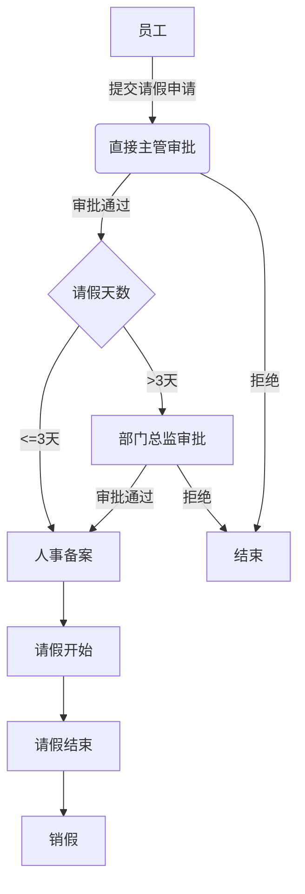

# 测试

```bash {.line-numbers}
npm install mermaid
```
## 请假流程图


```mermaid
flowchart TD
    A[员工] -->|提交请假申请| B(直接主管审批)
    B -->|审批通过| C{请假天数}
    B -->|拒绝| D[结束]
    C -->|<=3天| E[人事备案]
    C -->|>3天| F[部门总监审批]
    F -->|审批通过| E
    F -->|拒绝| D
    E --> G[请假开始]
    G --> H[请假结束]
    H --> I[销假]
```