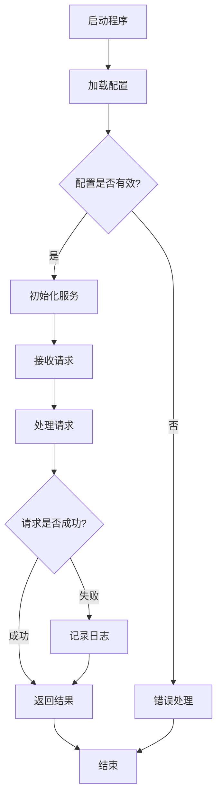
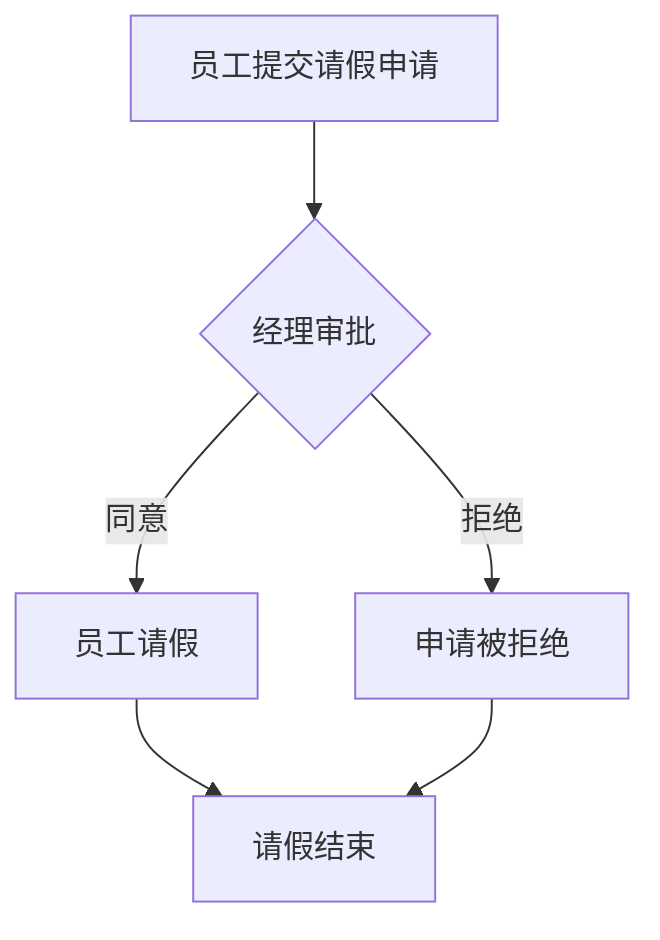
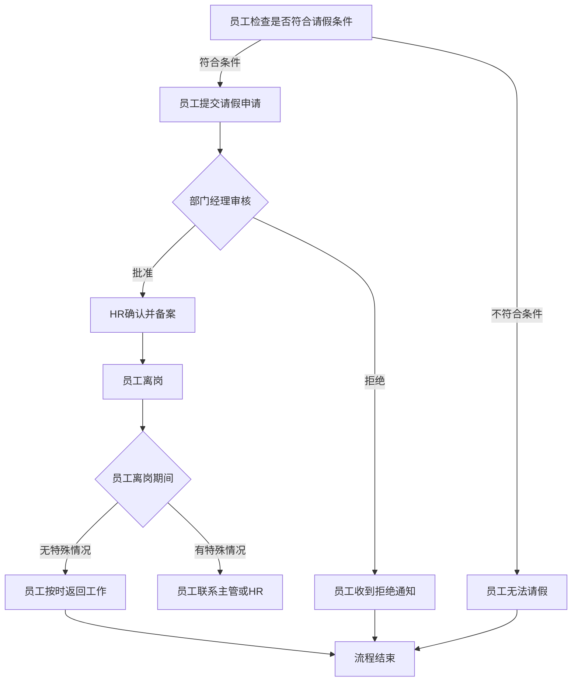
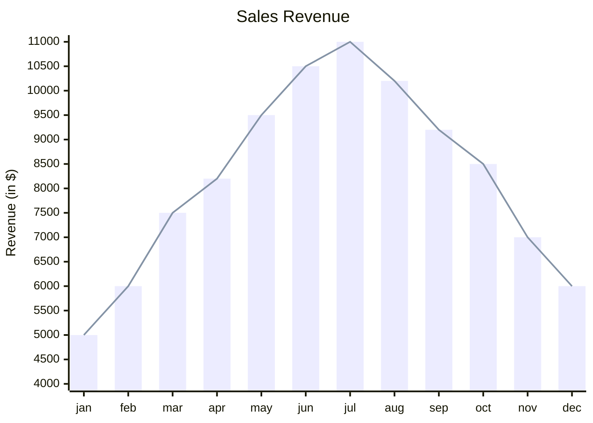
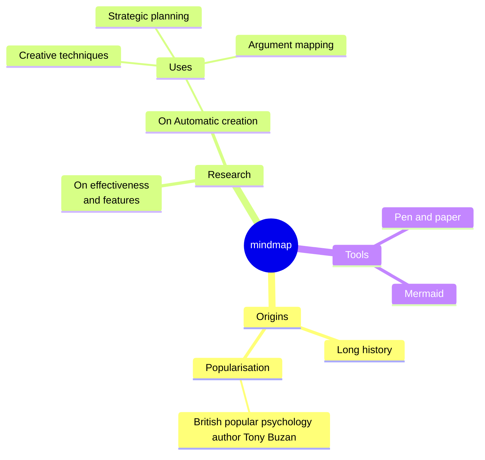

# 测试

```bash {.line-numbers}
npm install mermaid
for i in {1..10}; do
    echo $i
done

for i in {1..10}; do
    echo $i
done
```


```mermaid
graph TD
    A[启动程序] --> B[加载配置]
    B --> C{配置是否有效?}
    C -- 是 --> D[初始化服务]
    C -- 否 --> E[错误处理]
    D --> F[接收请求]
    F --> G[处理请求]
    G --> H{请求是否成功?}
    H -- 成功 --> I[返回结果]
    H -- 失败 --> J[记录日志]
    J --> I
    I --> K[结束]
    E --> K

```
graph TD

```mermaid
graph TD
    A[员工提交请假申请] --> B{经理审批}
    B -- 同意 --> C[员工请假]
    B -- 拒绝 --> D[申请被拒绝]
    C --> E[请假结束]
    D --> E
```


## 请假流程图

```mermaid
flowchart TD
    A[员工检查是否符合请假条件] -->|符合条件| B[员工提交请假申请]
    A -->|不符合条件| Z[员工无法请假]
    B --> C{部门经理审核}
    C -->|批准| D[HR确认并备案]
    C -->|拒绝| E[员工收到拒绝通知]
    D --> F[员工离岗]
    F --> G{员工离岗期间}
    G -->|无特殊情况| H[员工按时返回工作]
    G -->|有特殊情况| I[员工联系主管或HR]
    H --> J[流程结束]
    E --> J
    Z --> J
```


```mermaid
xychart-beta
    title "Sales Revenue"
    x-axis [jan, feb, mar, apr, may, jun, jul, aug, sep, oct, nov, dec]
    y-axis "Revenue (in $)" 4000 --> 11000
    bar [5000, 6000, 7500, 8200, 9500, 10500, 11000, 10200, 9200, 8500, 7000, 6000]
    line [5000, 6000, 7500, 8200, 9500, 10500, 11000, 10200, 9200, 8500, 7000, 6000]
```



```mermaid
mindmap
  root((mindmap))
    Origins
      Long history
      ::icon(fa fa-book)
      Popularisation
        British popular psychology author Tony Buzan
    Research
      On effectiveness<br/>and features
      On Automatic creation
        Uses
            Creative techniques
            Strategic planning
            Argument mapping
    Tools
      Pen and paper
      Mermaid
```
---
